# Portafolio Grupo 4 Latam

## CREACIÓN DE TABLAS, PRIMARY KEY Y FOREIGN KEY

        create table grupo04.aeropuertos
    (
	aeropuerto_id	     	nvarchar(400)	not null,
	nombre_aeropuerto		nvarchar(400),
	ciudad	      			nvarchar(400),			
	departamento            nvarchar(400)
    )

        create table grupo04.vuelo_mercado_nacional
    (
	periodo_id					nvarchar(400)  	not null,
	cantidad_pasajeros          integer
	)

	    create table grupo04.aviones
    (
	avion_id     integer not null identity,
	modelo       varchar(400), 
	capacidad  	 integer
		)

		create table grupo04.vuelo_numero
    (
	vuelo_numero_id           integer not null,                 
	hora_inicio_programada    time,
	hora_llegada_programada   time,
	aeropuerto_origen_id      nvarchar(400),
	aeropuerto_destino_id     nvarchar(400)
			)

		create table grupo04.vuelo_detalle
    (
	vuelo_id                  integer not null identity,
	vuelo_numero_id           integer not null,                 
	fecha_inicio_real		  date,
	hora_inicio_real		  time,
	fecha_llegada_real		  date,
	hora_llegada_real         time,
	avion_id				  integer
			)

		create table grupo04.pasajero
(
	pasajero_id         integer not null identity,
	nombre              nvarchar(400),  
	tipo_documento      nvarchar(400),
	numero_documento    integer,
	sexo                nvarchar(400),
	nacionalidad        nvarchar(400),
			)

		create table grupo04.boletos
(
	boleto_id			integer not null identity,
	vuelo_id			integer not null,
	pasajero_id         integer not null,
	tipo_cabina_id      integer,
	precio_final		integer,
	fecha_compra		date,
	periodo_id			nvarchar(400)  	not null
		)

		create table grupo04.tipo_cabina
(
	tipo_cabina_id      integer not null identity,
	nombre				nvarchar(400)
		)

### PRIMARY KEY

alter table grupo04.aeropuertos add constraint pk_grupo04_aeropuertos
primary key (aeropuerto_id)

alter table grupo04.vuelo_mercado_nacional add constraint pk_grupo04_vuelo_mercado_nacional
primary key (periodo_id)

alter table grupo04.vuelo_detalle add constraint pk_grupo04_vuelo_detalle
primary key (vuelo_id)

alter table grupo04.aviones add constraint pk_grupo04_aviones
primary key (avion_id)

alter table grupo04.vuelo_numero add constraint pk_grupo04_vuelo_numero
primary key (vuelo_numero_id)

alter table grupo04.pasajero add constraint pk_grupo04_pasajero
primary key (pasajero_id)

alter table grupo04.boletos add constraint pk_grupo04_boletos
primary key (boleto_id)

alter table grupo04.tipo_cabina add constraint pk_grupo04_tipo_cabina
primary key (tipo_cabina_id)

### FOREIGN KEY

alter table grupo04.vuelo_numero add constraint fk_grupo04_vuelo_numero_grupo4_aeropuertos
foreign key (aeropuerto_origen_id) references grupo04.aeropuertos(aeropuerto_id)

alter table grupo04.vuelo_numero add constraint fk_grupo04_vuelo_numero_grupo4_aeropuerto_destino
foreign key (aeropuerto_destino_id) references grupo04.aeropuertos(aeropuerto_id)

alter table grupo04.vuelo_detalle add constraint fk_grupo04_vuelo_detalle_grupo4_vuelo_numero
foreign key (vuelo_numero_id) references grupo04.vuelo_numero(vuelo_numero_id)

alter table grupo04.boletos add constraint fk_grupo04_boletos_grupo4_vuelo_detalle
foreign key (vuelo_id) references grupo04.vuelo_detalle(vuelo_id)

alter table grupo04.boletos add constraint fk_grupo04_boletos_grupo4_pasajero
foreign key (pasajero_id) references grupo04.pasajero(pasajero_id)

alter table grupo04.boletos add constraint fk_grupo04_boletos_grupo4_tipo_cabina
foreign key (tipo_cabina_id) references grupo04.tipo_cabina(tipo_cabina_id)

alter table grupo04.vuelo_detalle add constraint fk_grupo04_vuelo_detalle_grupo4_aviones
foreign key (avion_id) references grupo04.aviones(avion_id)

alter table grupo04.boletos add constraint fk_grupo04_boletos_grupo04_vuelo_mercado_nacional
foreign key (periodo_id) references grupo04.vuelo_mercado_nacional(periodo_id)

## INSERCIÓN DE DATOS EN LAS TABLAS

### DATOS FIJOS

INSERT INTO grupo04.aeropuertos (aeropuerto_id, nombre_aeropuerto, Ciudad, Departamento)
VALUES
('CUZ', 'A. VELASCO ASTETE', 'CUZCO', 'CUZCO'),
('LIM', 'JORGE CHÁVEZ', 'LIMA', 'LIMA'),
('AQP', 'RODRIGUEZ BALLON', 'AREQUIPA', 'AREQUIPA'),
('AYP', 'A. MENDIVIL', 'AYACUCHO', 'AYACUCHO'),
('CIX', 'CAPITAN FAP JOSE ALBERTO QUIÑONES', 'CHICLAYO', 'LAMBAYEQUE'),
('CJA', 'ARMANDO REVOREDO', 'CAJAMARCA', 'CAJAMARCA'),
('ILQ', 'ILO', 'ILO', 'MOQUEGUA'),
('IQT', 'C.F.SECADA', 'IQUITOS', 'IQUITOS'),
('JAU', 'JAUJA', 'JAUJA', 'JUNÍN'),
('JUL', 'INCA MANCO CAPAC', 'JULIACA', 'PUNO'),
('PCL', 'CAPITAN DAVID ABENSUR', 'PUCALLPA', 'PUCALLPA'),
('PEM', 'PADRE ALDAMIZ', 'PUERTO MALDONADO', 'MADRE DE DIOS'),
('PIU', 'G. CONCHA IBERICO', 'PIURA', 'PIURA'),
('TRU', 'C. MARTINEZ DE PINILLOS', 'TRUJILLO', 'TRUJILLO'),
('TYL', 'V MONTES ARIAS', 'TALARA', 'PIURA'),
('TCQ', 'CARLOS CIRIANI SANTA ROSA', 'TACNA', 'TACNA'),
('TBP', 'P. CANGA RODRIGUEZ', 'TUMBES', 'TUMBES'),
('JAE', 'SHUMBA', 'JAÉN', 'CAJAMARCA'),
('ATA', 'COMANDANTE FAP GERMÁN ARIAS GRAZIANI', 'HUARAZ', 'ÁNCASH');

INSERT INTO grupo04.aviones (Modelo, Capacidad)
VALUES
('BOEING 777', 470),
('AIRBUS A320', 180),
('BOEING 787 - 8', 247),
('BOEING 787 - 9', 304),
('BOEING 767', 233),
('AIRBUS 319', 144),
('AIRBUS 321', 224);

INSERT INTO grupo04.vuelo_numero (Vuelo_numero_id, Hora_inicio_programada, Hora_llegada_programada, aeropuerto_origen_id, aeropuerto_destino_id)
VALUES
(1001, '04:00', '05:30', 'LIM', 'CUZ'),
(1002, '04:25', '05:55', 'CUZ', 'LIM'),
(1003, '04:50', '06:20', 'LIM', 'CUZ'),
(1004, '05:15', '06:45', 'CUZ', 'LIM'),
(1005, '05:40', '07:10', 'LIM', 'CUZ'),
(1006, '06:05', '07:35', 'CUZ', 'LIM'),
(1007, '06:30', '08:00', 'LIM', 'AQP'),
(1008, '06:55', '08:25', 'AQP', 'LIM'),
(1009, '07:20', '08:50', 'LIM', 'AQP'),
(1010, '07:45', '09:15', 'AQP', 'LIM'),
(1011, '08:10', '09:40', 'LIM', 'JAE'),
(1012, '08:35', '10:05', 'JAE', 'LIM'),
(1013, '09:00', '10:30', 'LIM', 'ATA'),
(1014, '09:25', '10:55', 'ATA', 'LIM'),
(1015, '09:50', '11:20', 'LIM', 'CIX'),
(1016, '10:15', '11:45', 'CIX', 'LIM'),
(1017, '10:40', '12:10', 'LIM', 'CJA'),
(1018, '11:05', '12:35', 'CJA', 'LIM'),
(1019, '11:30', '13:00', 'LIM', 'ILQ'),
(1020, '11:55', '13:25', 'ILQ', 'LIM'),
(1021, '12:20', '13:50', 'LIM', 'IQT'),
(1022, '12:45', '14:15', 'IQT', 'LIM'),
(1023, '13:10', '14:40', 'LIM', 'JAU'),
(1024, '13:35', '15:05', 'JAU', 'LIM'),
(1025, '14:00', '15:30', 'LIM', 'JUL'),
(1026, '14:25', '15:55', 'JUL', 'LIM'),
(1027, '14:50', '16:20', 'LIM', 'PCL'),
(1028, '15:15', '16:45', 'PCL', 'LIM'),
(1029, '15:40', '17:10', 'LIM', 'PEM'),
(1030, '16:05', '17:35', 'PEM', 'LIM'),
(1031, '16:30', '18:00', 'LIM', 'PIU'),
(1032, '16:55', '18:25', 'PIU', 'LIM'),
(1033, '17:20', '18:50', 'LIM', 'TRU'),
(1034, '17:45', '19:15', 'TRU', 'LIM'),
(1035, '18:10', '19:40', 'LIM', 'TYL'),
(1036, '18:35', '20:05', 'TYL', 'LIM'),
(1037, '19:00', '20:30', 'LIM', 'TCQ'),
(1038, '19:25', '20:55', 'TCQ', 'LIM'),
(1039, '19:50', '21:20', 'LIM', 'TBP'),
(1040, '20:15', '21:45', 'TBP', 'LIM');

INSERT INTO grupo04.tipo_cabina (nombre)
VALUES
('ECONÓMICA'),
('BUSINESS');

### DATOS ALEATORIOS

-- Inserción inicial de datos en la tabla vuelo_mercado_nacional
-- Declarar variables para la fecha y el ciclo
DECLARE @fecha_inicio DATE = '2024-07-01';
DECLARE @fecha_fin DATE = '2026-01-01';
DECLARE @fecha_actual DATE;
DECLARE @nombre_mes NVARCHAR(20);
DECLARE @ANIO NVARCHAR(4);
DECLARE @PERIODO NVARCHAR(20);
DECLARE @valor_mes NVARCHAR(2);

SET @fecha_actual = @fecha_inicio;

WHILE @fecha_actual <= @fecha_fin
BEGIN
    -- Obtener el nombre del mes en español
    SET @nombre_mes = 
        CASE MONTH(@fecha_actual)
            WHEN 1 THEN 'Enero'
            WHEN 2 THEN 'Febrero'
            WHEN 3 THEN 'Marzo'
            WHEN 4 THEN 'Abril'
            WHEN 5 THEN 'Mayo'
            WHEN 6 THEN 'Junio'
            WHEN 7 THEN 'Julio'
            WHEN 8 THEN 'Agosto'
            WHEN 9 THEN 'Septiembre'
            WHEN 10 THEN 'Octubre'
            WHEN 11 THEN 'Noviembre'
            WHEN 12 THEN 'Diciembre'
        END;

    -- Obtener el año y el valor del mes como número
    SET @ANIO = CAST(YEAR(@fecha_actual) AS NVARCHAR(4));
    SET @valor_mes = RIGHT('0' + CAST(MONTH(@fecha_actual) AS NVARCHAR(2)), 2); -- Asegura que el mes tenga dos dígitos

    -- Formatear el Periodo_id
    SET @PERIODO = @ANIO + '_' + @valor_mes;

    -- Insertar en la tabla grupo04.vuelo_mercado_nacional con cantidad_boletos = 0
    INSERT INTO grupo04.vuelo_mercado_nacional (periodo_id, cantidad_boletos, nombre_mes, ANIO, PERIODO, valor_mes)
    VALUES (@fecha_actual, 0, @nombre_mes, @ANIO, @PERIODO, @valor_mes);

    -- Incrementar la fecha actual al siguiente mes
    SET @fecha_actual = DATEADD(MONTH, 1, @fecha_actual);
END;

--- INSERTAR DATOS A TABLA PASAJERO---

-- Utilizar una tabla temporal para generar los datos aleatorios
CREATE TABLE #tmp_pasajeros (
    id INT IDENTITY(1,1) PRIMARY KEY,
    Nombre VARCHAR(255),
    Tipo_Documento VARCHAR(50),
    Numero_documento BIGINT, -- Cambiado a BIGINT para manejar números grandes
    Sexo CHAR(1), -- Cambiado a CHAR(1) para sexo (M/F)
    Nacionalidad VARCHAR(50)
);

-- Insertar 36,000 registros con nombres secuenciales y datos aleatorios
DECLARE @nombre_id INT = 1;
DECLARE @contador INT = 1;

WHILE @contador <= 36000
BEGIN
    INSERT INTO #tmp_pasajeros (Nombre, Tipo_Documento, Numero_documento, Sexo, Nacionalidad)
    VALUES (
        'Cliente ' + CAST(@nombre_id AS VARCHAR(10)),
        CASE WHEN RAND() < 0.5 THEN 'DNI' ELSE 'PASAPORTE' END,
        CAST(CAST(RAND() * 900000000 AS BIGINT) AS VARCHAR(50)), -- Generar BIGINT y luego convertir a VARCHAR
        CASE WHEN RAND() < 0.5 THEN 'M' ELSE 'F' END,
        CASE 
            WHEN RAND() < 0.3 THEN 'Peruana' 
            WHEN RAND() < 0.6 THEN 'Argentina' 
            ELSE 'Chilena' 
        END
    );

    SET @nombre_id = @nombre_id + 1;
    SET @contador = @contador + 1;
END;

-- Insertar los datos generados en la tabla final grupo04.pasajero
INSERT INTO grupo04.pasajero (Nombre, Tipo_Documento, Numero_documento, Sexo, Nacionalidad)
SELECT Nombre, Tipo_Documento, Numero_documento, Sexo, Nacionalidad
FROM #tmp_pasajeros;

-- Eliminar la tabla temporal después de insertar los datos
DROP TABLE #tmp_pasajeros;

--- INSERTAR DATOS A TABLA VUELO DETALLE---

-- Utilizar una tabla temporal para generar los datos
CREATE TABLE #tmp_vuelo_detalle (
    Vuelo_numero_id INT,
    Fecha_inicio_real DATE,
    Hora_inicio_real TIME,
    Fecha_llegada_real DATE,
    Hora_llegada_real TIME,
    Avion_id INT
);

-- Declarar variables para fechas y hora
DECLARE @fecha_inicio DATE = '2023-01-01';
DECLARE @fecha_fin DATE = '2024-06-30'; -- Ajustar la fecha final según sea necesario
DECLARE @hora_inicio_real TIME;
DECLARE @hora_inicio_programada TIME;
DECLARE @hora_llegada_real TIME;
DECLARE @avion_id INT;
DECLARE @vuelo_numero_id INT; -- Declarar la variable aquí para que esté disponible
DECLARE @fecha_actual DATE;

-- Cursor para recorrer los vuelos y generar los datos
DECLARE cur CURSOR FOR
SELECT Vuelo_numero_id, Hora_inicio_programada
FROM grupo04.vuelo_numero;

OPEN cur;

FETCH NEXT FROM cur INTO @vuelo_numero_id, @hora_inicio_programada;

WHILE @@FETCH_STATUS = 0
BEGIN
    -- Inicializar fecha actual para cada iteración del cursor
    SET @fecha_actual = @fecha_inicio;
    
    -- Generar datos para cada vuelo repetido 546 veces
    DECLARE @contador INT = 1;

    WHILE @fecha_actual <= @fecha_fin AND @contador <= 546
    BEGIN
        -- Generar Hora_inicio_real sumando entre 0 a 15 minutos a Hora_inicio_programada
        DECLARE @minutos_aleatorios INT = ROUND(RAND() * 15, 0);
        SET @hora_inicio_real = DATEADD(MINUTE, @minutos_aleatorios, @hora_inicio_programada);

        -- Generar Hora_llegada_real sumando 1.5 horas a Hora_inicio_real
        SET @hora_llegada_real = DATEADD(HOUR, 1.5, @hora_inicio_real);

        -- Asignar Avion_id según el Vuelo_numero_id
        SET @avion_id = CASE
                            WHEN @vuelo_numero_id IN (1011, 1012, 1013, 1014, 1023, 1024)
                                THEN 6
                            ELSE 2
                        END;

        -- Insertar en la tabla temporal
        INSERT INTO #tmp_vuelo_detalle (Vuelo_numero_id, Fecha_inicio_real, Hora_inicio_real, Fecha_llegada_real, Hora_llegada_real, Avion_id)
        VALUES (@vuelo_numero_id, @fecha_actual, @hora_inicio_real, @fecha_actual, @hora_llegada_real, @avion_id);

        SET @fecha_actual = DATEADD(DAY, 1, @fecha_actual);
        SET @contador = @contador + 1;
    END;

    FETCH NEXT FROM cur INTO @vuelo_numero_id, @hora_inicio_programada;
END;

CLOSE cur;
DEALLOCATE cur;

-- Insertar los datos generados en la tabla final grupo04.vuelo_detalle
INSERT INTO grupo04.vuelo_detalle (Vuelo_numero_id, Fecha_inicio_real, Hora_inicio_real, Fecha_llegada_real, Hora_llegada_real, Avion_id)
SELECT Vuelo_numero_id, Fecha_inicio_real, Hora_inicio_real, Fecha_llegada_real, Hora_llegada_real, Avion_id
FROM #tmp_vuelo_detalle;

-- Eliminar la tabla temporal después de insertar los datos
DROP TABLE #tmp_vuelo_detalle;

--- INSERTAR DATOS A TABLA BOLETOS---

-- Declaración de variables
DECLARE @contador INT = 1;
DECLARE @vuelo_id INT, @pasajero_id INT, @tipo_cabina_id INT;
DECLARE @precio_final DECIMAL(10, 2), @fecha_compra DATE;
DECLARE @nombre_mes NVARCHAR(20), @ANIO NVARCHAR(4), @valor_mes NVARCHAR(2), @PERIODO NVARCHAR(20);

-- Bucle para insertar los datos
WHILE @contador <= 36000
BEGIN
    -- Generación de datos aleatorios
    SET @vuelo_id = FLOOR(RAND() * 21840) + 1;
    SET @pasajero_id = @contador + 5;
    
    -- Determinar tipo_cabina_id con 90% de probabilidad para el valor 1
    IF (RAND() <= 0.9)
        SET @tipo_cabina_id = 1;
    ELSE
        SET @tipo_cabina_id = 2;
    
    -- Generar precio final aleatorio entre 50 y 180
    SET @precio_final = ROUND(RAND() * (180 - 50) + 50, 2);
    
    -- Generar fecha de compra aleatoria dentro de un rango de 548 días a partir del 1 de julio de 2024
    SET @fecha_compra = DATEADD(DAY, ROUND(RAND() * 548, 0), '2024-07-01');
    
    -- Obtener el nombre del mes en español
    SET @nombre_mes = 
        CASE MONTH(@fecha_compra)
            WHEN 1 THEN 'ENERO'
            WHEN 2 THEN 'FEBRERO'
            WHEN 3 THEN 'MARZO'
            WHEN 4 THEN 'ABRIL'
            WHEN 5 THEN 'MAYO'
            WHEN 6 THEN 'JUNIO'
            WHEN 7 THEN 'JULIO'
            WHEN 8 THEN 'AGOSTO'
            WHEN 9 THEN 'SETIEMBRE'
            WHEN 10 THEN 'OCTUBRE'
            WHEN 11 THEN 'NOVIEMBRE'
            WHEN 12 THEN 'DICIEMBRE'
        END;
    
    -- Obtener el año y el valor del mes como número
    SET @ANIO = CAST(YEAR(@fecha_compra) AS NVARCHAR(4));
    SET @valor_mes = RIGHT('0' + CAST(MONTH(@fecha_compra) AS NVARCHAR(2)), 2); -- Asegura que el mes tenga dos dígitos
    
    -- Formatear el Periodo_id
    SET @PERIODO = @ANIO + '_' + @valor_mes;

    -- Insertar en la tabla grupo04.boletos
    BEGIN TRY
        INSERT INTO grupo04.boletos (Vuelo_id, Pasajero_id, tipo_cabina_id, Precio_Final, Fecha_Compra, nombre_mes, ANIO, valor_mes, PERIODO)
        VALUES (@vuelo_id, @pasajero_id, @tipo_cabina_id, @precio_final, @fecha_compra, @nombre_mes, @ANIO, @valor_mes, @PERIODO);
    END TRY
    BEGIN CATCH
        -- Manejo de errores
        PRINT 'Error al insertar registro: ' + ERROR_MESSAGE();
    END CATCH;

    -- Incrementar contador
    SET @contador = @contador + 1;
END;

## BUSINESS CASE

El presente es el Business case de nuestro proyecto

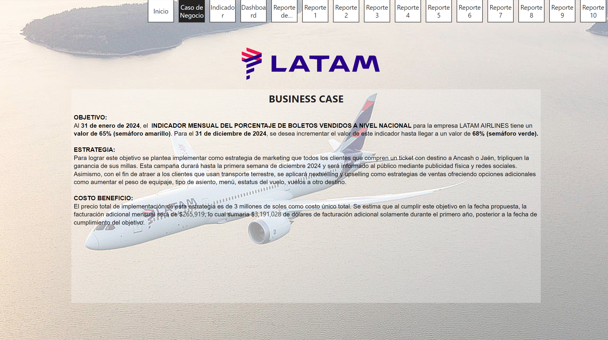

### INDICADOR MENSUAL DEL PORCENTAJE DE BOLETOS VENDIDOS A NIVEL NACIONAL POR LA LÍNEA ÁEREA LATAM AIRLINES

El KPI que buscamos medir es el INDICADOR MENSUAL DEL PORCENTAJE DE BOLETOS VENDIDOS A NIVEL NACIONAL POR LA LÍNEA ÁEREA LATAM AIRLINES

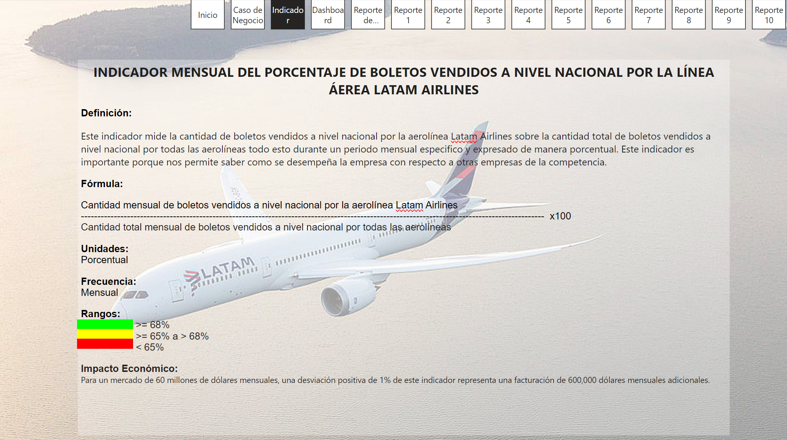

### DASHBOARD

A 01/2024 nos encontramos en un 65% de nuestro KPI.

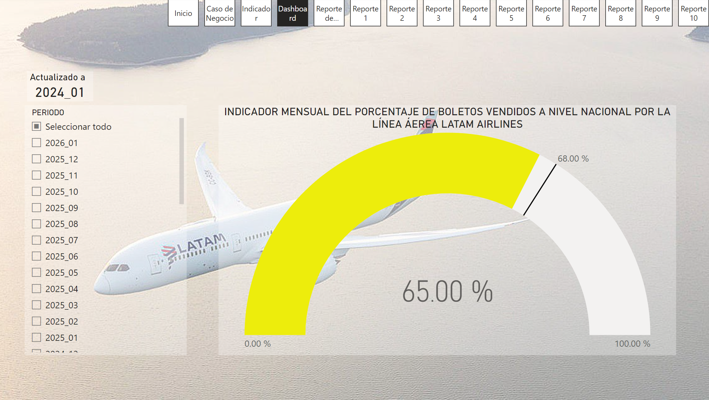

### REPORTE DEL INDICADOR

El presente es el reporte de nuestro KPI donde podemos observar que aplicando nuestra estrategia obtendriamos un incremento de $3,191,028 en nuestra facturacion a 12/2025

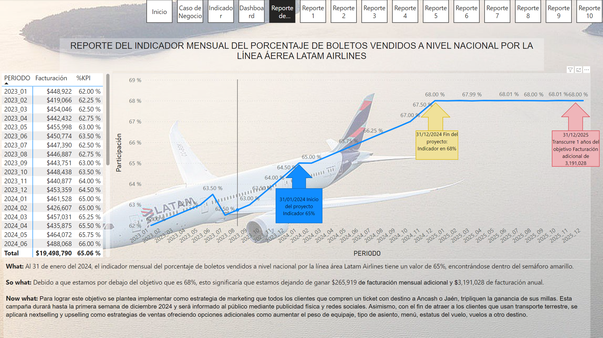

### PREGUNTA 1 : ¿Cuál es la participación mensual de mercado en base a boletos vendidos a nivel nacional por LATAM en los últimos 12 meses y la facturación correspondiente?

Podemos observar que la participación de LATAM en el mercado nacional en los ultimos 12 meses ha incrementado hasta llegar a un 65% en 06/2024 acercandonos a nuestro objetivo del 68%.

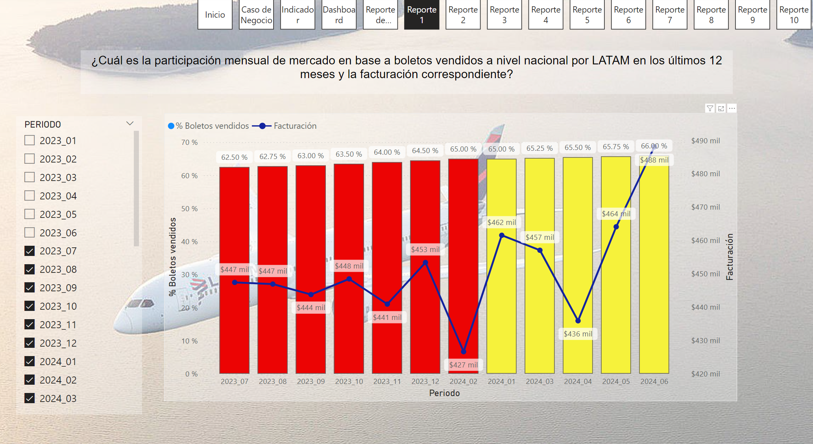

### PREGUNTA 2 : ¿Cuáles son los 5 destinos de LATAM que han tenido mayor crecimiento interanual en junio 2024 en porcentaje y cantidad de pasajeros?

Hemos identificado los 5 destinos con mayor crecimiento interanual en junio 2024, lo cual nos permitiria implementar estrategias de nextselling y upselling que nos genere un incremento en nuestra participacion.

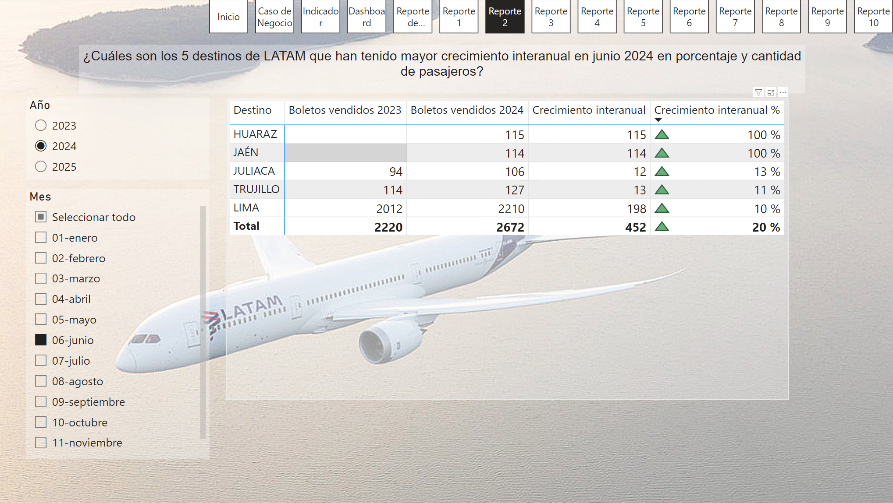

### PREGUNTA 3 : ¿Cuáles son los 10 destinos con mayor participación de LATAM en base a boletos vendidos a nivel nacional de manera mensual en el 2024?

Podemos ver que la relación de los 10 destinos más importantes para LATAM destacando en mayor porcentaje Lima.

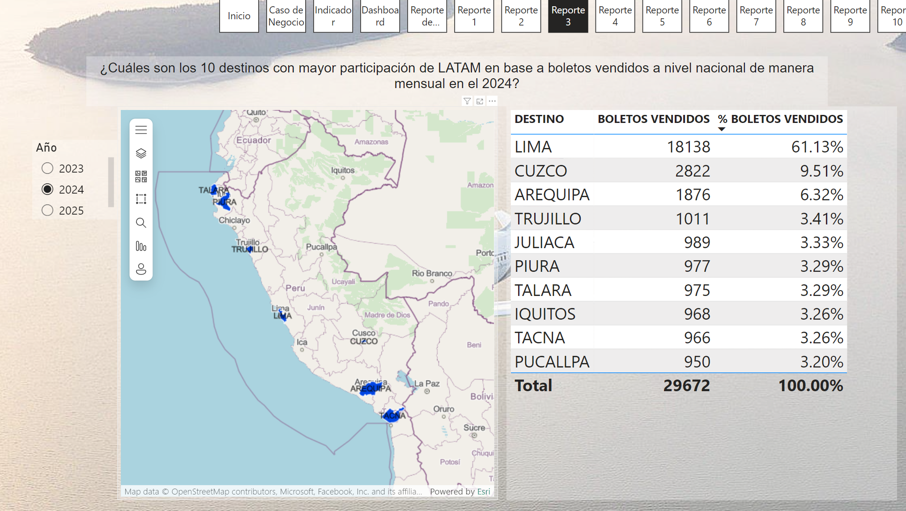

### PREGUNTA 4 : ¿ En que mes del año 2024 LATAM vendió más boletos?

Podemos identificar que el mes con mayor ventas del 2024 ha sido junio, con lo cual podriamos identificarlo como un mes importante para el desarrollo de estrategias.

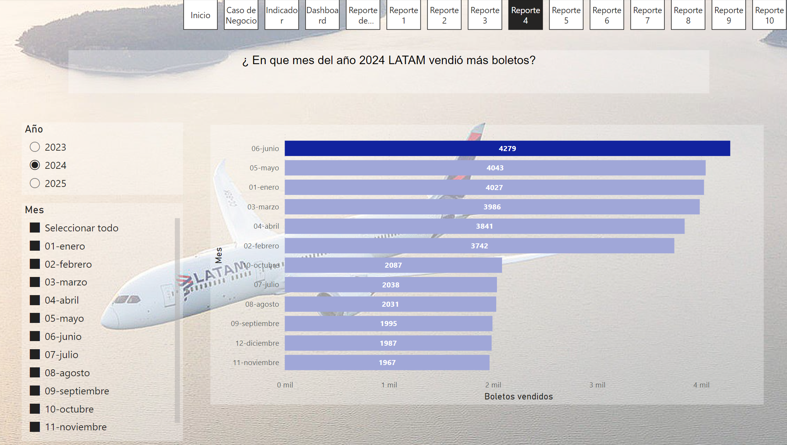

### PREGUNTA 5 : ¿ Cuántos pasajeros extranjeros se han transportado mensualmente durante el año 2024 ?

En este grafico identificamos que la mayor cantidad de pasajeros transportados son extranjeros, por tanto, podriamos diseñar promociones dirijidas a pasajeros que vienen de un vuelo desde el extranjero.

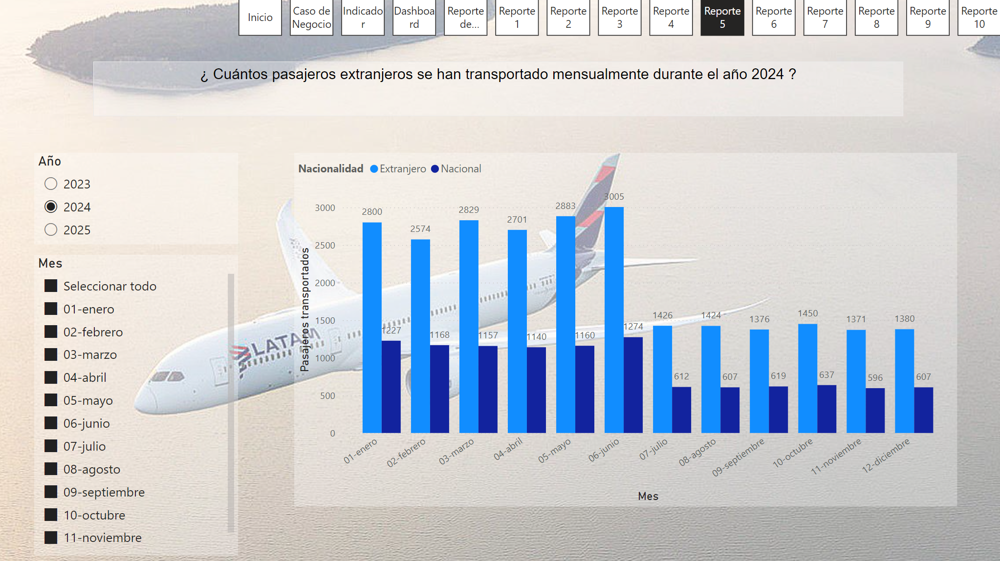

### PREGUNTA 6 : ¿Cuáles son los 10 destinos de LATAM que han tenido el menor porcentaje boletos vendidos en cabina business a nivel nacional durante el 2024?

Observamos que al ser destinos nuevos, Jaén y Huaraz tienen la menor cantidad de boletos vendidos en el año.

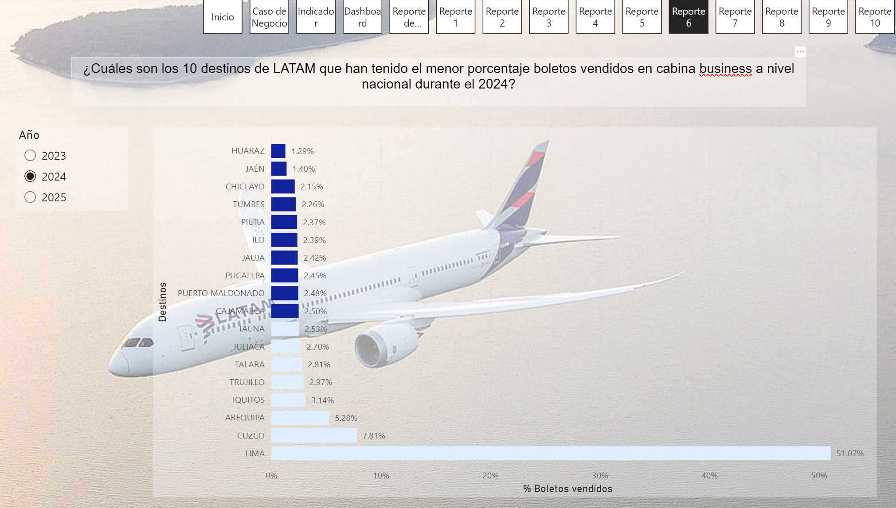

### PREGUNTA 7 : ¿Qué tipo de cabina ha tenido el mayor crecimiento interanual en porcentaje de boletos vendidos en junio 2024?

Verificamos que la cabina Business es la que ha tenido mayor crecimiento en junio 2024, respecto a junio 2023, por lo tanto, sería importante la implementación de descuentos para boletos en dicha cabina e impulsar su crecimiento, lo cual nos permitiría alcanzar nuestro objetivo de participación.

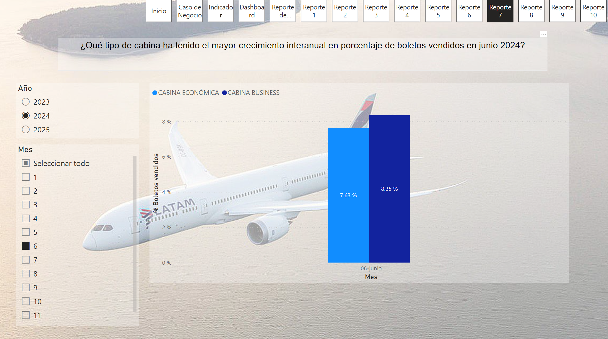

### PREGUNTA 8 : ¿Cuál es el top 3 de meses con la mayor cantidad de boletos vendidos durante el 2024?

Podemos verificar que la temporada alta en la venta de boletos se encontraría en mayor parte en el primer semestre del año.

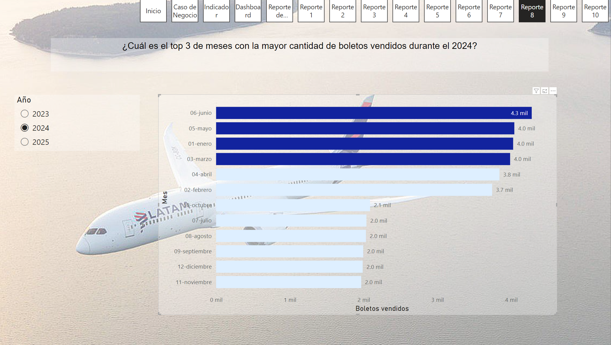

### PREGUNTA 9 : ¿Cuáles son los 5 destinos de LATAM con mayor facturación mensual en el 2024?

Identificamos a Lima como el destino con mayro facturación, sin embargo observamos otras ciudades en crecimiento como cuzco y arequipa.

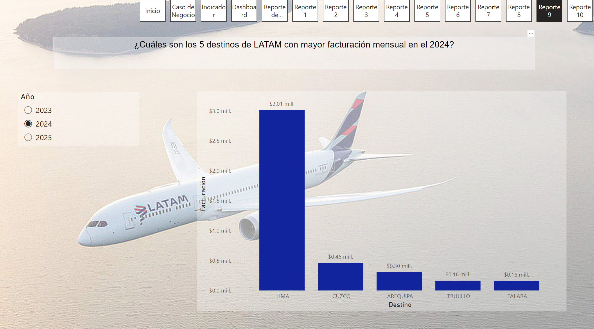

### PREGUNTA 10 : ¿Cuál es el top 5 de destinos con mayor boletos vendidos a mujeres en junio del 2024 en porcentaje?

En este gráfico indentificamos los destinos preferidos por las mujeres, lo cual nos permitiría implementar estrategias dirigida a este sexo, con el fin de incrementar la participación en el mercado nacional.

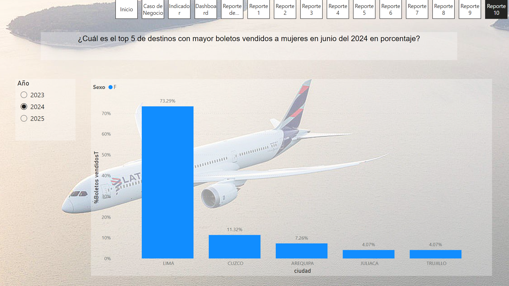